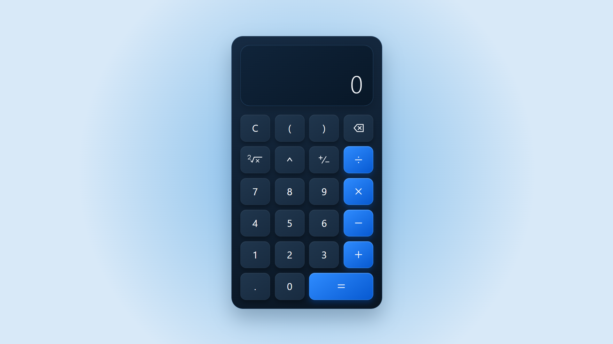

<div>

# PHP Calculator

A responsive, session-based web calculator built with **PHP, HTML, and CSS** — no JavaScript or third-party dependencies required.

[](https://www.php.net/)
[](LICENSE)


</div>

## Overview

PHP Calculator is a lightweight web application that performs calculations entirely on the server. Each keypad action is submitted through an HTTP `POST` request, processed by PHP, and stored in the user's session so the current expression persists between requests.

The project includes a custom expression evaluator and does **not** rely on PHP's `eval()` function. It supports operator precedence, nested parentheses, exponentiation, square roots, decimal values, negative numbers, and controlled recovery from invalid calculations.

<div >



</div>

## Features

- Addition, subtraction, multiplication, and division
- Exponentiation with right-to-left associativity
- Square-root calculations
- Nested parentheses and automatic closing of unmatched opening parentheses
- Decimal and negative-number input
- Positive/negative sign toggle
- Result chaining for continued calculations
- Clear and backspace controls
- Server-side state management with PHP sessions
- Error handling for division by zero, negative square roots, and `0^0`
- Responsive interface for desktop, tablet, and mobile screens
- Accessible labels for icon-based controls and visible keyboard focus styles
- Custom SVG icons with no external UI library
- No database, package manager, build step, or JavaScript required

## Technology Stack

| Technology   | Purpose                                                                      |
|--------------|------------------------------------------------------------------------------|
| PHP 8.0+     | Request handling, session state, input validation, and expression evaluation |
| HTML5        | Calculator structure and form controls                                       |
| CSS3         | Responsive layout, visual design, transitions, and component styling         |
| PHP Sessions | Preserving calculator state between requests                                 |

## How It Works

1. The user selects a calculator key.
2. The form sends the selected key to `index.php` using `POST`.
3. The current calculator state is loaded from `$_SESSION`.
4. `processSelectedKey()` routes the input to its dedicated handler.
5. The expression is stored as validated tokens rather than executable code.
6. When `=` is selected, the custom evaluator resolves the expression according to mathematical precedence.
7. The updated expression, result, or error is saved to the session and rendered in the display.

### Evaluation Order

| Priority | Operation                   | Associativity               |
|---------:|-----------------------------|-----------------------------|
|        1 | Parentheses                 | Innermost first             |
|        2 | Square root                 | Rightmost first when nested |
|        3 | Exponentiation              | Right to left               |
|        4 | Multiplication and division | Left to right               |
|        5 | Addition and subtraction    | Left to right               |

## Getting Started

### Requirements

- PHP 8.0 or newer
- A modern web browser
- PHP sessions enabled

No Composer or npm installation is needed.

### Run with PHP's Built-in Server

Clone the repository:

```bash
git clone https://github.com/Alan-Shahoei/php-calculator.git
cd php-calculator
```

Start the development server:

```bash
php -S 127.0.0.1:8000
```

Then open `http://127.0.0.1:8000` in your browser.

### Run with XAMPP, WAMP, or Laragon

1. Copy the project directory into your local server's document root, such as `htdocs` or `www`.
2. Start Apache.
3. Open the corresponding local URL, for example `http://localhost/php-calculator`.

## Usage Examples

| Expression     |                 Result |
|----------------|-----------------------:|
| `2 + 3 × 4`    |                   `14` |
| `(12 - 4) ÷ 2` |                    `4` |
| `2 ^ 3 ^ 2`    |                  `512` |
| `√(81)`        |                    `9` |
| `5 ÷ 0`        | Division-by-zero error |

After a result is displayed, selecting an operator continues the calculation with that result. Selecting a digit starts a new expression.

## Error Handling

Invalid operations such as division by zero, square roots of negative numbers, and `0^0` are shown as controlled error messages. After an error, enter a digit to start a new expression or press `C` to reset the calculator.

## Project Structure

| File                            | Description                                                                                |
|---------------------------------|--------------------------------------------------------------------------------------------|
| `index.php`                     | Starts the session, processes requests, prepares display values, and renders the interface |
| `calculator.php`                | Contains key handlers, state transitions, validation rules, and the expression evaluator   |
| `style.css`                     | Defines the responsive layout, color system, controls, icons, and interaction states       |
| `.gitignore`                    | Excludes local IDE configuration files                                                     |
| `LICENSE`                       | Contains the MIT License                                                                   |
| `assets/calculator-preview.png` | Project preview image used in this README                                                  |

## License

This project is available under the [MIT License](LICENSE).

## Author

Created by [Alan Shahoei](https://github.com/Alan-Shahoei).
